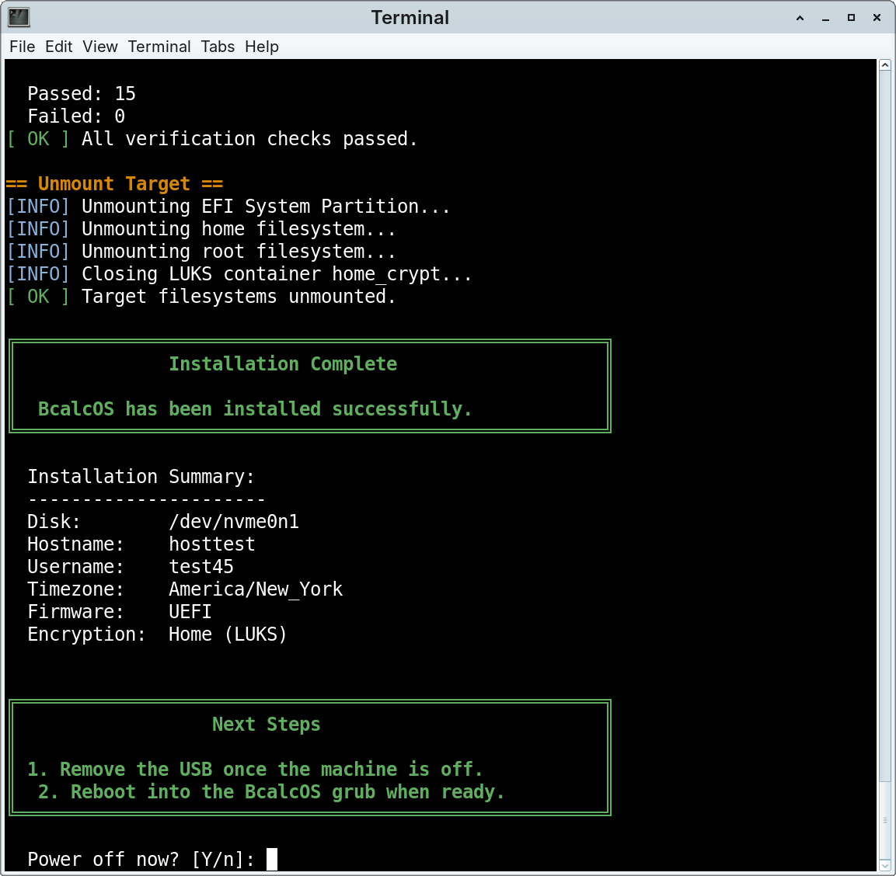
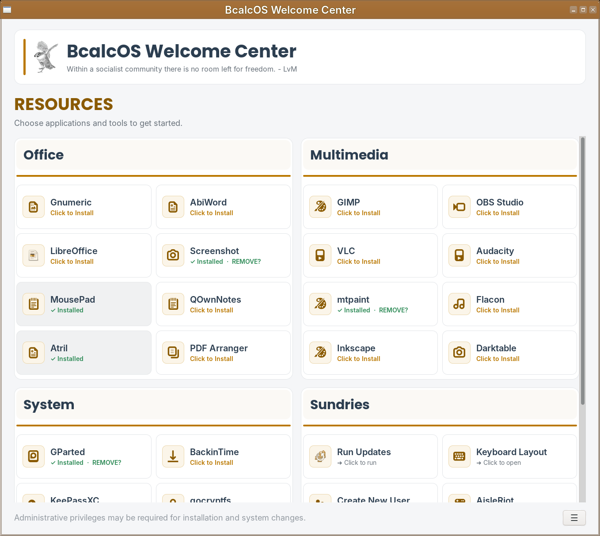
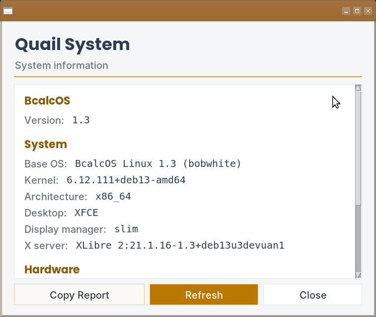
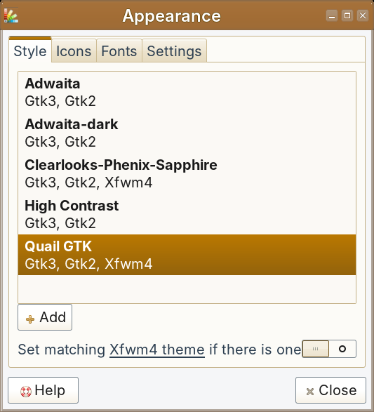

# BcalcOS Linux

BcalcOS is a user-friendly Linux desktop distribution built on Devuan Excalibur.

It combines the Devuan operating-system foundation with a defined desktop environment, deliberate system choices, custom configuration, applications, packages, a installer, and a software repository to provide a ready to use, general purpose desktop system.

BcalcOS is built around complementary ideas: simpler software is usually better, individual components should have a clear purpose, and those components should work well together. The project favors straightforward, easily understandable solutions while recognizing that users should remain free to customize their systems.

## Contents

- [What is BcalcOS?](#what-is-bcalcos)
- [The BcalcOS System](#the-bcalcos-system)
  - [The Foundation: Devuan](#the-foundation-devuan)
  - [SysVinit](#sysvinit)
  - [XLibre](#xlibre)
  - [SLiM](#slim)
  - [Xfce](#xfce)
- [What Makes It BcalcOS?](#what-makes-it-bcalcos)
  - [A common starting system](#a-common-starting-system)
  - [Custom installation](#custom-installation)
  - [Welcome Center](#welcome-center)
  - [Custom applications](#custom-applications)
  - [BcalcOS Repositories](#bcalcos-repositories)
  - [BcalcOS Visual Identity](#bcalcos-visual-identity)
- [Software Distribution and Updates](#software-distribution-and-updates)
- [How BcalcOS Is Built](#how-bcalcos-is-built)
- [The BcalcOS Approach](#the-bcalcos-approach)
- [Who Is BcalcOS For?](#who-is-bcalcos-for)
- [Documentation and Community](#documentation-and-community)
- [Current BcalcOS](#current-bcalcos)
- [License](#license)

---

## What is BcalcOS?

BcalcOS starts with Devuan and builds its own system on top of it.

Devuan provides the Debian-derived operating system foundation, including the kernel, core system components, security updates, and access to the large Debian software ecosystem.

BcalcOS then makes its own choices about the components and configuration that form the finished desktop.

The result is intended not simply to be a rebrand of the default Devuan installation. BcalcOS defines a particular starting system and adds its own:

- system configuration
- desktop configuration
- software selection
- custom installer
- Welcome Center
- custom applications and utilities
- APT repository
- themes, icons, and visual identity
- documentation and supporting tools

The **goal is a stable, user-friendly, good-to-go, general use Linux desktop** that provides a coherent starting point while leaving users of all experience levels free to customize it.

---

## The BcalcOS System

BcalcOS is built from a defined set of major system components:

| Component | BcalcOS choice |
|---|---|
| Operating system foundation | Devuan Excalibur |
| Init system | SysVinit |
| Display server | XLibre |
| Display manager | SLiM |
| Desktop environment | Xfce |

### The Foundation: Devuan

BcalcOS is built on Devuan Excalibur.

Devuan is a Debian-derived Linux distribution that maintains compatibility with the Debian software ecosystem while taking a different approach to system initialization. In particular, Devuan supports alternative init systems to systemd.

BcalcOS uses SysVinit as its init system; Devuan provides the foundation that makes this choice possible without BcalcOS having to independently remove systemd from a standard Debian installation.

For more background, see the BcalcOS Community vignette [Devuan: The Foundation of BcalcOS](https://bcalcos.discourse.group/t/devuan-the-foundation-of-bcalcos/30).

### SysVinit

SysVinit is a mature and well-understood approach to system initialization. It brings the system up, starts services, and manages transitions between system states.  BcalcOS uses SysVinit because it fits the project's preference for a straightforward system with explicit and understandable service management.

For further discussion, see the BcalcOS Community vignettes [SysVinit: System Initialization](https://bcalcos.discourse.group/t/sysvinit-system-initialization/34), and [Living Without systemd](https://bcalcos.discourse.group/t/living-without-systemd/55).

We also have a ~12 part series (WIP)  **In Depth:  SysVinit** which goes into much more detail. I am not an init expert which part of the appeal of SysVinit: you aren't required to become a SME to understand it.  [1/12 What is SysVinit?](https://bcalcos.discourse.group/t/what-is-sysvinit/62/2), [2/12 Core Concept:  Runlevels](https://bcalcos.discourse.group/t/core-concept-runlevels/63), [3/12 Core Concept:  Init Scripts](https://bcalcos.discourse.group/t/core-concept-init-scripts/64), [4/12 Core Concept:  Services & Programs](https://bcalcos.discourse.group/t/core-concept-services-programs/65), [5/12 Core Concept:  Runlevel Configuration](https://bcalcos.discourse.group/t/core-concept-runlevel-configuration/66), and [6/12 The Boot Process](https://bcalcos.discourse.group/t/the-boot-process/67). 

### XLibre

BcalcOS uses XLibre as its display server.

XLibre is a continuation of the X.Org X server and provides continued development of the X11 graphical environment while maintaining compatibility with the established X11 ecosystem.

BcalcOS uses XLibre because the project considers it a capable and maintainable fit for the desktop system being built.

See the BcalcOS Community vignettes [XLibre:  What is it?](https://bcalcos.discourse.group/t/xlibre-what-is-it/25), [Why BcalcOS Uses XLibre](https://bcalcos.discourse.group/t/why-bcalcos-uses-xlibre/26), and [XLibre:  Things to Know](https://bcalcos.discourse.group/t/xlibre-things-to-know/27) for additional information.

### SLiM

BcalcOS uses SLiM as its display manager.

SLiM provides the graphical login screen and starts the user's desktop session. It is intentionally limited in scope: authenticate the user, launch the session, and get out of the way.

See the BcalcOS Community vignette [SLiM: The BcalcOS Display Manager](https://bcalcos.discourse.group/t/slim-the-bcalcos-display-manager/37) for more notes.

### Xfce

BcalcOS uses Xfce as its desktop environment.

Xfce is a mature, modular, and configurable desktop that provides a familiar graphical environment without requiring a large collection of tightly integrated desktop services.

For additional background, see the BcalcOS Community vignette [Xfce:  The BcalcOS Desktop](https://bcalcos.discourse.group/t/xfce-the-bcalcos-desktop/35).

---

## What Makes It BcalcOS?

BcalcOS provides a purposely designed desktop experience.

### A common starting system

BcalcOS establishes a common starting point for users. The installed system has a defined set of packages, applications, configuration, desktop components, and aesthetics.

Users can subsequently customize the system to suit their own needs.

### Custom installation

BcalcOS includes its own terminal-based installer.

The installer is designed specifically around the BcalcOS system rather than attempting to support a wide range of possible Linux installation scenarios. This keeps the installation process relatively straightforward and beginner-friendly, but it also means the installer makes defined assumptions and has specific limitations.  
 

For a much more in depth discussion, see the BcalcOS Community vignettes [BcalcOS Installer:  Design Notes & Trade-offs](https://bcalcos.discourse.group/t/bcalcos-installer-design-notes-trade-offs/19), [BcalcOS Installation Process](https://bcalcos.discourse.group/t/bcalcos-installation-process/20), [Before You Install BcalcOS](https://bcalcos.discourse.group/t/before-you-install-bcalcos/22), [What Happens to the Disk?](https://bcalcos.discourse.group/t/what-happens-to-the-disk-during-installation/23), [Encryption Explained](https://bcalcos.discourse.group/t/encryption-explained/24), [Dual Boot Grub Note](https://bcalcos.discourse.group/t/dual-boot-grub-note/49), and [The BcalcOS Filesystem](https://bcalcos.discourse.group/t/the-bcalcos-filesystem/45).

### Welcome Center

BcalcOS includes the BcalcOS Welcome Center, a graphical application that helps users get started with the system.

The Welcome Center provides access to curated applications, basic system functions, and resource guides.  It makes common tasks available without requiring novice users to immediately learn the command line or search through documentation. 

 
### Custom applications

BcalcOS includes applications and supporting tools developed specifically for the distribution.

These currently include applications and scripts such as:

- BcalcOS Welcome Center
- Quail Calc
- Quail Reminder
- Quail System
- Quail Converter
- Update Notifier
- Fstrim Maintenance 

 

For more details, see the BcalcOS Community vignettes [BcalcOS Extra Apps & Packages](https://bcalcos.discourse.group/t/bcalcos-extra-apps-packages/52) and [BcalcOS Maintenance Tools](https://bcalcos.discourse.group/t/bcalcos-maintenance-tools/41).

### BcalcOS Repositories

Devuan repositories provide the majority of the underlying operating system and general-purpose software.

BcalcOS also maintains its own APT repository. It includes custom BcalcOS applications and packages, as well as selected third-party applications that are not available through the standard Devuan repositories. Currently, those third-party applications include Marp, QOwnNotes, and Flacon.

The BcalcOS repository allows these packages to be installed and updated using the normal Debian/Devuan APT package-management system.

For additional information, see the BcalcOS Community vignettes [BcalcOS Software Repositories](https://bcalcos.discourse.group/t/bcalcos-software-repositories/44) and [BcalcOS Base Repo](https://bcalcos.discourse.group/t/bcalcos-base-repo/51). 

### BcalcOS Visual Identity

BcalcOS has its own aesthetics as part of the designed BcalcOS desktop experience.
 

This includes branding as well as the Quail GTK theme and Quail Icons icon set.  All of which can, of course, be changed by users if desired.

For additional information, see the BcalcOS Community vignette [BcalcOS Theme & Icons](https://bcalcos.discourse.group/t/bcalcos-theme-icons/53). 

---

## Software Distribution and Updates

BcalcOS builds on the established Debian/Devuan APT and dpkg package-management system.

BcalcOS custom software is distributed through its own repository while the underlying operating system continues to use the appropriate upstream repositories.

See the BcalcOS Community vignettes [Updating BcalcOS](https://bcalcos.discourse.group/t/updating-bcalcos/28) and [Installing Software](https://bcalcos.discourse.group/t/installing-software/29) for more information.

---

## How BcalcOS Is Built

This GitHub repository contains the source, configuration, packaging, and supporting components used to build BcalcOS.

The major areas of the repository include:

- `branding/` BcalcOS visual assets and branding
- `commonapps/` independent applications packaged by BcalcOS
- `distroapps/` custom BcalcOS applications
- `distroconfig/` custom BcalcOS configuration scripts
- `distroscripts/` custom BcalcOS maintenance scripts
- `packages/` Debian packaging for software distributed by BcalcOS
- `.github/workflows/` automated package-building workflows

---

## The BcalcOS Approach

The technical choices in BcalcOS reflect several general principles.

- Simplicity is valuable.
- There should be multiple ways to build a desktop.
- Software should be judged on its technical merits. 
- Old software can still be useful. 
- Components should have clear purposes.

---

## Who Is BcalcOS For?

BcalcOS is for, well, me.

And anyone else interested in a stable, general purpose Linux distribution that just works out-of-the-box.

It may be particularly interesting to those who:

- wish to try a systemd-free OS
- prefer a straightforward init system such as SysVinit
- want to use XLibre
- like Brave Origin as the default browser
- appreciate the familiar Xfce desktop
- want a predefined starting point rather than assembling the various components themselves
- are interested in a small, independently maintained Linux distribution

BcalcOS is not intended to be everything to everyone. Users who need applications that require systemd, prefer a rolling-release distribution, or want the latest software versions will likely find that another Linux distribution is a better fit.

The [Why BcalcOS?](https://bcalcos.discourse.group/t/why-bcalcos-linux/33) vignette provides a philosophical answer to why BcalcOS exists.

---

## Documentation and Community

BcalcOS utilizes several public facing resources:

BcalcOS Website: [BcalcOS.org](https://bcalcos.org/) is the distribution's primary website and provides general information, technical details, applications, installation information, and other user-oriented material.

BcalcOS Community: [Discourse](https://bcalcos.discourse.group/) provides discussion, announcements, and support.  The **More You Know** vignettes provide focused explanations of individual components, installation, applications, troubleshooting, and design decisions.

BcalcOS Repository: [GitHub](https://github.com/briancalc/bcalcos) contains the source, configuration, packaging, and other implementation components used to build BcalcOS.

BcalcOS Downloads: [SourceForge](https://sourceforge.net/projects/bcalcos-linux/files/) provides BcalcOS ISO downloads and associated checksums.

---

## Current BcalcOS

**Current release:** BcalcOS 1.3.5 (bobwhite)  
Base: Devuan Excalibur  
Architecture: 64-bit x86  
Package management: APT / dpkg  
Init: SysVinit  
Display server: XLibre  
Display manager: SLiM  
Desktop: Xfce

Because BcalcOS is an active project, individual applications, packages, and other components can change between releases. See the BcalcOS Community on [Discourse](https://bcalcos.discourse.group/c/announcements/5) for current notes.

---

## License

BcalcOS Linux is released under the GNU General Public License, Version 3 (GPL-3).

Some included packages and applications may be distributed under different licenses. 

BcalcOS is free to use, modify, and distribute under the terms of its applicable licenses.